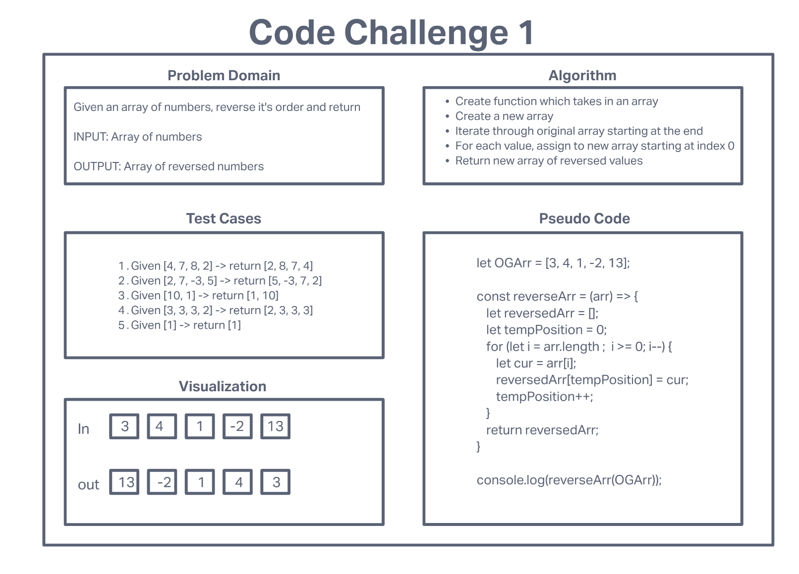
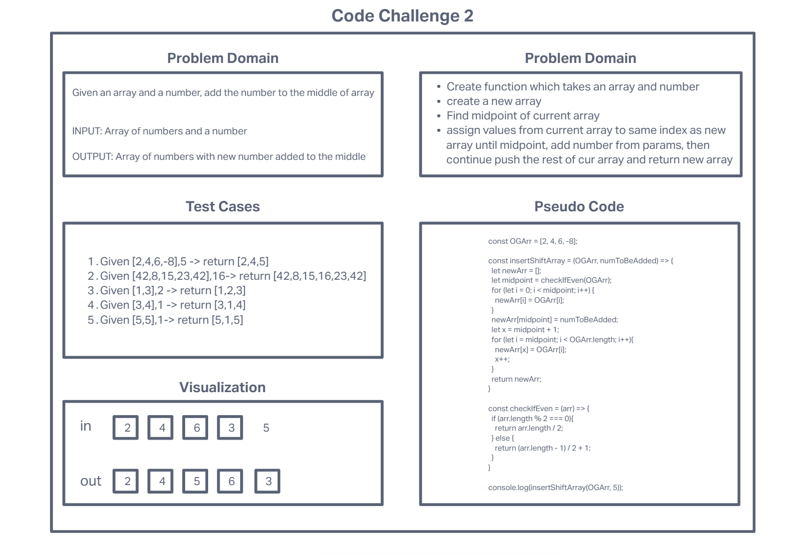
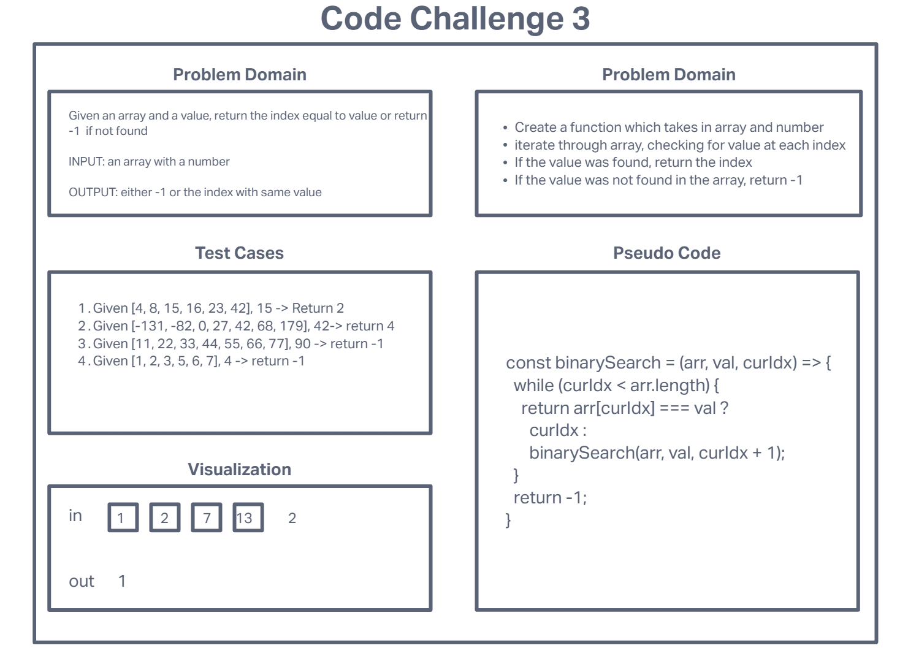
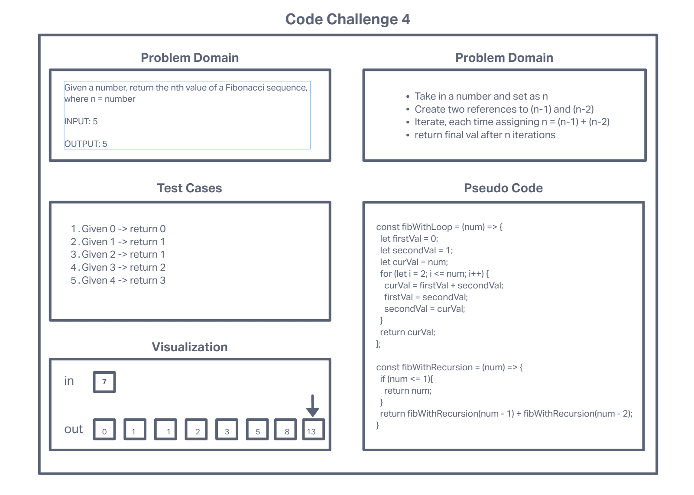

# Data Structures and Algorithms

## Language: `JavaScript`

### Folder and Challenge Setup

Each type of code challenge has slightly different instructions. Please refer to the notes and examples below for instructions for each DS&A assignment type.

### Data Structure: New Implementation

- Create a new folder under the `javascript` level, with the name of the data structure and complete your implementation there
  - i.e. `linked-list`
- Implementation (the data structure "class")
  - The implementation of the data structure must be named `index.js`
  - Your implementation must be completed as a proper ES6 Class, and exported as a node module
    - Class Name must be `ProperCase`
    - Class Methods must be `camelCase`

    ```javascript
    class LinkedList {
      constructor() {
        // code
      }

      methodName() {
        // code
      }

    }
    module.exports = LinkedList;
    ```

- Tests
  - Create folder named `__tests__` and within it, a test file called `[data-structure].test.js`
    - i.e. `__tests__/linked-list.test.js`
    - Your tests will then need to require the data structure you're testing
      - i.e. `const LinkedList = require('../index');

### Data Structure: Extending an implementation

- Work within the data structure implementation
- Create a new method within the class that solves the code challenge
  - Remember, you'll have access to `this` within your class methods
- Tests
  - You will have folder named `__tests__` and within it, a test file called `[data-structure].test.js`
    - i.e. `__tests__/linked-list.test.js`
    - Add to the tests written for this data structure to cover your new method(s)

### Code Challenge / Algorithm

Code challenges should be completed within a folder named `code-challenges` under the `javascript` level

- Daily Setup:
  - Create a new folder under the `javascript` level, with the name of the code challenge
    - Each code challenge assignment identifies the branch name to use, for example 'find-maximum-value'
    - For clarity, create your folder with the same name, ensuring that it's `kebab-cased`
    - i.e. For a challenge named 'find-maximum-value', create the folder:`code-challenges/find-maximum-value`
  - Code Challenge Implementation
    - Each code challenge requires a function be written, for example "find maximum value"
    - Name the actual challenge file with the name of the challenge, in `kebab-case`
      - i.e. `find-maximum-value.js`
    - Reminder: Your challenge file will then need to require the data structure you're using to implement
      - i.e. `const LinkedList = require('../linked-list');
    - Your challenge function name is up to you, but it's recommended that you use camel case
      - i.e. `function findMaximumValue(list) { ... }`
    - Be sure to export your function so that you can write tests
  - Tests
    - Create folder named `__tests__` and within it, a test file called `[challenge].test.js`
      - i.e. `__tests__/find-maximum-value.test.js`
      - Your test file would require the challenge file found in the directory above, which has your exported function
        - i.e. `const reverse = require('../find-maximum-value.js');

## Running Tests

If you setup your folders according to the above guidelines, running tests becomes a matter of deciding which tests you want to execute.  Jest does a good job at finding the test files that match what you specify in the test command

From the `data-structures-and-algorithms/javascript` folder, execute the following commands:

- **Run every possible test** - `npm test`
- **Run a test for a data structure** - `npm test linked-list`
- **Run a test for a specific challenge** - `npm test reverse-ll`

#### Live Tests

Note that when you check your code into GitHub, all of your tests will automatically execute. These results should match your own, and will be found on the  **Actions** tab

## 401 Whiteboard Challenge

# Code Challenge 1




# Code Challenge 2



# Code Challenge 3



# Code Challenge 4



# Code Challenge 9


# Code Challenge 14


# Code Challenge 26


# Code Challenge 27


